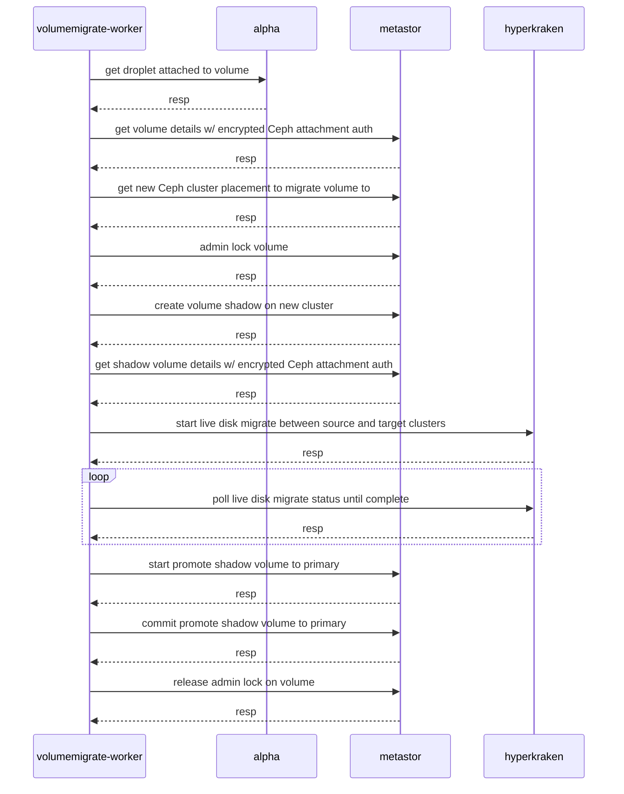

# test

```mermaid
sequenceDiagram;
    participant volumemigrate-worker;
    participant alpha;
    participant metastor;
    participant hyperkraken;

    volumemigrate-worker->>alpha: get droplet attached to volume;
    alpha-->>volumemigrate-worker: resp
    volumemigrate-worker->>metastor: get volume details w/ encrypted Ceph attachment auth;
    metastor-->>volumemigrate-worker: resp
    volumemigrate-worker->>metastor: get new Ceph cluster placement to migrate volume to;
    metastor-->>volumemigrate-worker: resp
    volumemigrate-worker->>metastor: admin lock volume;
    metastor-->>volumemigrate-worker: resp
    volumemigrate-worker->>metastor: create volume shadow on new cluster;
    metastor-->>volumemigrate-worker: resp
    volumemigrate-worker->>metastor: get shadow volume details w/ encrypted Ceph attachment auth;
    metastor-->>volumemigrate-worker: resp
    volumemigrate-worker->>hyperkraken: start live disk migrate between source and target clusters;
    hyperkraken-->>volumemigrate-worker: resp
    loop;
        volumemigrate-worker->>hyperkraken: poll live disk migrate status until complete;
        hyperkraken-->>volumemigrate-worker: resp
    end;
    volumemigrate-worker->>metastor: start promote shadow volume to primary;
    metastor-->>volumemigrate-worker: resp
    volumemigrate-worker->>metastor: commit promote shadow volume to primary;
    metastor-->>volumemigrate-worker: resp
    volumemigrate-worker->>metastor: release admin lock on volume;
    metastor-->>volumemigrate-worker: resp

```
